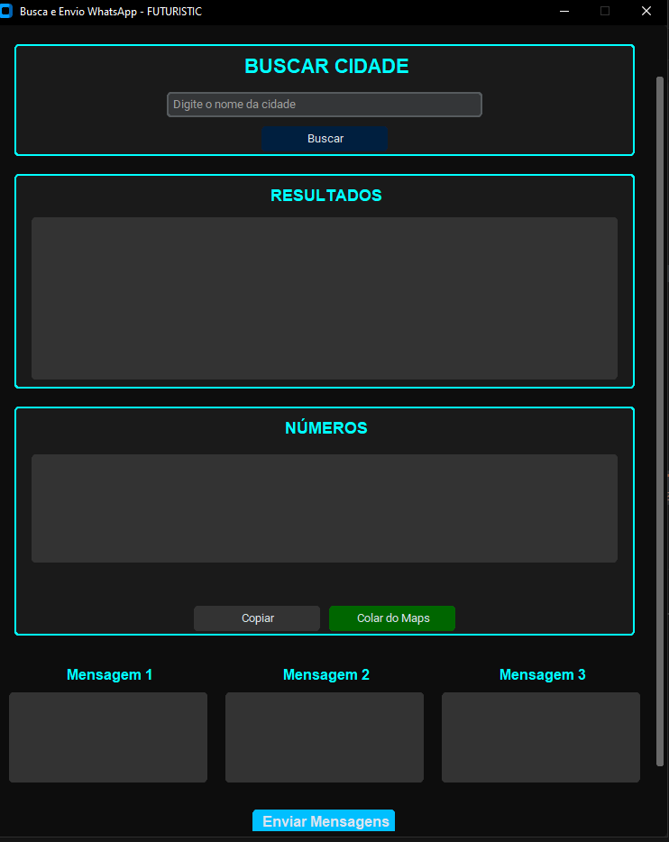
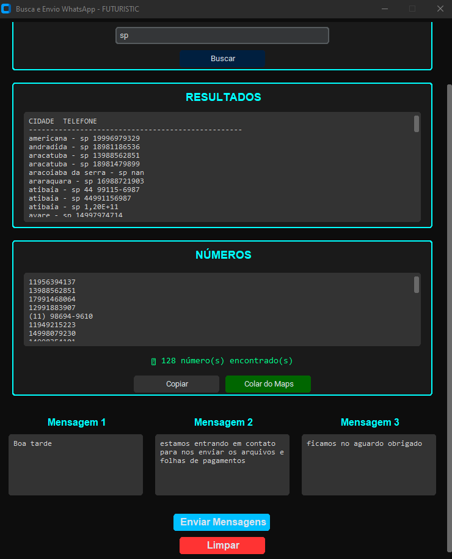

# 🤖 Automação de Busca e Envio WhatsApp

Aplicação desktop desenvolvida em Python com interface gráfica moderna que permite buscar números por cidade e enviar mensagens automaticamente via WhatsApp.

---

##  Sobre o projeto
Este sistema foi criado para automatizar o processo de busca de contatos em uma planilha online e envio de mensagens em massa utilizando o WhatsApp Web.

A aplicação possui uma interface moderna com estilo futurista, facilitando o uso e organização dos dados.

---

##  Funcionalidades
- Busca de contatos por cidade
- Integração com Google Sheets (CSV online)
- Normalização de texto (ignora acentos)
- Extração automática de números
- Envio automático de mensagens via WhatsApp
- Suporte a até 3 mensagens por contato
- Contador de números encontrados
- Barra de progresso de envio
- Sistema de cópia e colagem de números
- Interface gráfica moderna com CustomTkinter

---

##  Tecnologias utilizadas
- Python
- Tkinter / CustomTkinter
- Pandas
- PyAutoGUI
- Pyperclip
- Threading

---

##  Estrutura do projeto
/projeto
├── app.py
├── assets/
│ ├── tela_inicial.png
│ └── busca_sp.png
├── foto.png
├── foto2.png
├── foto4.png
├── foto5.png
├── foto6.png
└── README.md

##  Como executar o projeto

### 1. Instalar dependências

pip install pandas pyautogui customtkinter pyperclip

## 2. Executar o sistema
python app.py

## Como funciona
1- O usuário digita uma cidade
2- O sistema busca os dados na planilha online
3- Os números são extraídos automaticamente
4- O usuário escreve até 3 mensagens
5- O sistema envia automaticamente via WhatsApp Web

## Requisitos importantes
1- Ter o WhatsApp Web aberto
2- Manter as imagens (foto.png, etc.) na mesma pasta do projeto
3- Não mexer no mouse durante o envio automático

##Telas do sistema
## Tela Inicial

## Tela de exemplo

## Melhorias futuras
1- Detecção automática de número inválido
2- Interface ainda mais responsiva
3- Integração com banco de dados
4- Logs de envio detalhados
5- Sistema de pausa e retomada

## Autor

## José Ailton

## Projeto desenvolvido para fins de estudo e automação de tarefas.
